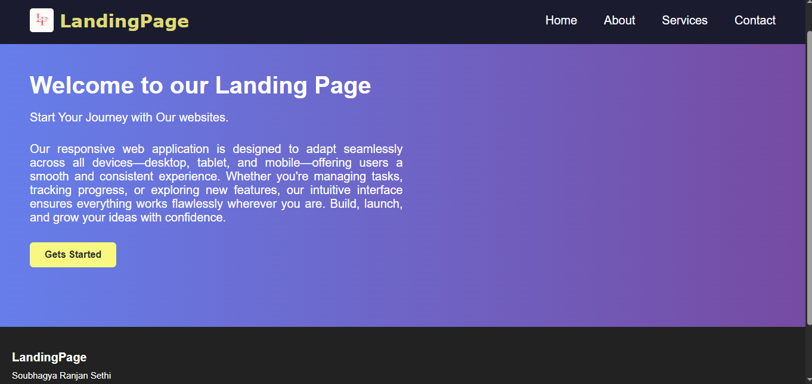
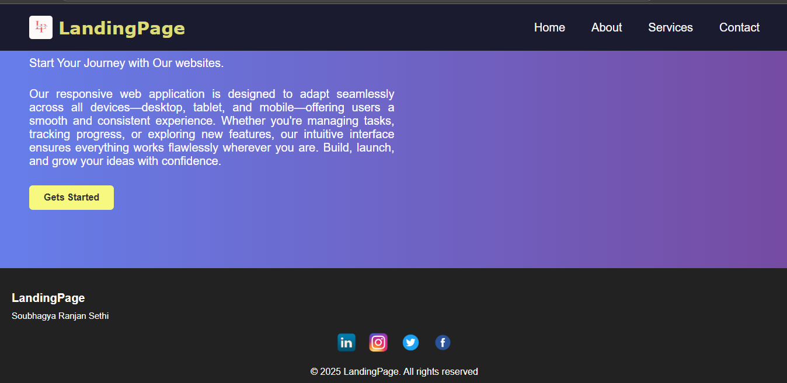
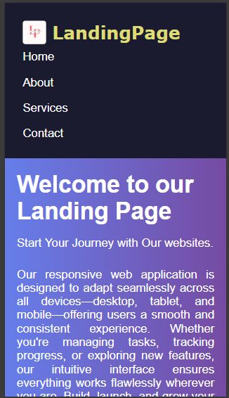
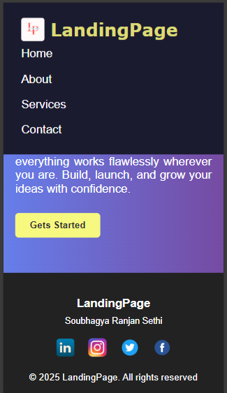

# 🚀 Landing Page
**Task 1 - Elevate Labs Web Development Internship**

This project is part of the **Elevate Labs Web Development Internship**, created as the first task assigned during the internship program. The goal of this task was to build a fully responsive **Landing Page** using only **HTML** and **CSS** .
Designed to work seamlessly across devices (mobile, tablet, desktop).

## 📸 Screenshots

Here are some screenshots of the Landing Page on different devices:

### 💻 Desktop View

### 📱 Desktop View & Laptop View

### 🧾 Mobile View

### 📍 Mobile View with Footer

---
## ✨ Features

- 🌈 Gradient hero section
- 📱 Fully responsive layout
- 📌 Sticky navbar
- 🔗 Social media icons in footer
- 💡 Clean and minimal design

---

## 📱 Responsive Breakpoints

- Mobile: `≤768px`
- Tablet: `768px–1024px`
- Desktop: `>1024px`

---
📦 Technologies Used
- HTML5

- CSS3 (Flexbox, Media Queries)

## 📁 Project Structure
landing-page/
├── index.html
├── style.css
├── images/
│ ├── logo.png
│ ├── facebook.png
│ ├── instagram.png
│ ├── twitter.png
│ ├── linkedin.png
│ ├── screenshot1.png
│ ├── screenshot2.png
│ ├── screenshot3.png
│ └── screenshot4.png
└── README.md

